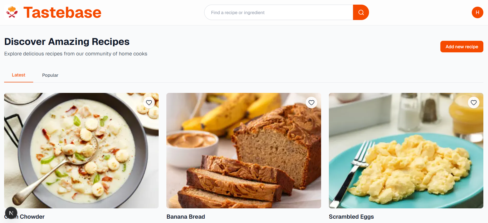

# Tastebase – Discover and Share Recipes

A full-featured recipe discovery platform built with Next.js 16 App Router, Supabase, and Tailwind CSS. Tastebase lets food lovers explore community recipes, manage personal creations, and curate wishlists with a polished, production-ready experience.

---

## Table of Contents
- [Live Demo](#live-demo)
- [Tech Stack](#tech-stack)
- [Key Features](#key-features)
- [Screenshots](#screenshots)
- [Getting Started](#getting-started)
  - [Prerequisites](#prerequisites)
  - [Environment Variables](#environment-variables)
  - [Supabase Setup](#supabase-setup)
  - [Install & Run](#install--run)
- [Project Structure](#project-structure)
- [Development Notes](#development-notes)
- [Deployment](#deployment)
- [Roadmap](#roadmap)
- [Contributing](#contributing)
- [License](#license)
- [Acknowledgements](#acknowledgements)

---

## Live Demo
- **Production**: [tastebase.vercel.app](https://tastebase-phi.vercel.app/)
- **Repository**: [github.com/DariaRosen/Tastebase](https://github.com/DariaRosen/Tastebase)

---

## Tech Stack
- **Framework**: Next.js 16 (App Router, React Server Components)
- **UI Layer**: Tailwind CSS, Shadcn UI, Radix UI
- **Auth & Database**: Supabase Auth, Postgres, Row-Level Security
- **Storage**: Supabase Storage (recipe images, avatars)
- **Icons & Media**: Lucide Icons, Next/Image
- **Tooling**: TypeScript, ESLint, Prettier, Vercel

---

## Key Features
- **Curated Browse Experience**: Latest and popular recipe tabs with public wishlist counts.
- **Advanced Search**: Header search with full-page results and responsive design.
- **Authenticated Actions**: Email-based signup/signin, profile management, avatar uploads.
- **Recipe Management**: Create, edit, and delete workflows with inline ingredient and step builders.
- **Wishlist System**: Save/unsave recipes, optimistic UI updates, and global save metrics.
- **My Recipes Dashboard**: Personalized overview of owned recipes with quick actions.
- **Responsive & Accessible UI**: Fully responsive layouts, keyboard-friendly interactions, and semantic HTML.

---

## Screenshots
> Add screenshots (Home, Recipe Detail, Create Recipe, Wishlist, Profile) to `public/screenshots/` and embed them here:
> ```md
> 
> ```

---

## Getting Started

### Prerequisites
- Node.js ≥ 18.18
- npm ≥ 9 (or pnpm/yarn/bun if preferred)

### Environment Variables
Create `.env.local` in the project root:

```bash
cp env.example .env.local
```

Then populate:

| Variable | Description |
| --- | --- |
| `NEXT_PUBLIC_SUPABASE_URL` | Supabase project URL |
| `NEXT_PUBLIC_SUPABASE_ANON_KEY` | Supabase anon key |
| `SUPABASE_SERVICE_ROLE_KEY` | (Optional) service key for server-side scripts |
| `NEXT_PUBLIC_SITE_URL` | Base URL for the deployed site |

> Never commit real keys to version control.

### Supabase Setup
1. **Database**: Run the SQL migrations located in `supabase/migrations/` (profiles, recipes, ingredients, steps, likes, saves, comments, views, RLS policies).
2. **Storage Buckets**:
   - `recipe-images` (public read, owner write)
   - `avatars` (public read, owner write)
3. **Auth Settings**:
   - Enable email authentication.
   - Configure redirect URLs to `NEXT_PUBLIC_SITE_URL/auth/callback`.
4. **Edge Functions (Optional)**: Deploy any Supabase functions required for advanced features.

### Install & Run
```bash
npm install
npm run dev
```
Visit [http://localhost:3000](http://localhost:3000) to explore the app locally.

---

## Project Structure
```
src/
├─ app/
│  ├─ (routes and layouts using App Router)
│  ├─ create/
│  ├─ recipe/[id]/
│  └─ my-recipes/
├─ components/
│  ├─ auth/
│  ├─ forms/
│  └─ ui/
├─ lib/
│  └─ supabase (client + server helpers)
└─ styles/
```

---

## Development Notes
- Uses React Server Components by default; client components declared with `'use client'` only where interactivity is required.
- Supabase client split between server (`createServerSupabase`) and client (`createClient`) for authentication-aware data access.
- Optimistic UI patterns for wishlist toggles keep interactions snappy.
- Tailwind utility classes + Shadcn components provide consistent, accessible UI primitives.
- Inline form builders for ingredients and steps leverage controlled arrays with accessible keyboard interactions.

---

## Deployment
- Deploys on Vercel via `vercel build`.
- Configure environment variables in the project dashboard (Settings → Environment Variables).
- Build command: `npm run build`
- Ensure `my-recipes` (and other auth-dependent routes) are marked `dynamic = 'force-dynamic'` to avoid build-time Supabase calls.

---

## Roadmap
- Advanced filtering (cuisine, dietary preferences).
- User comments and ratings on recipes.
- Social sharing and printable recipe layouts.
- Weekly featured recipes and newsletters.

---

## Contributing
1. Fork the repository.
2. Create a feature branch: `git checkout -b feature/your-feature-name`.
3. Commit your changes with clear messages.
4. Push and open a Pull Request against `main`.

---

## License
This project is open-sourced under the [MIT License](LICENSE).

---

## Acknowledgements
- [Next.js](https://nextjs.org)
- [Supabase](https://supabase.com)
- [Tailwind CSS](https://tailwindcss.com)
- [Shadcn UI](https://ui.shadcn.com)
- [Radix UI](https://www.radix-ui.com)
- Everyone sharing their favorite recipes ❤️
